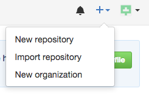

# GitHub Tutorial

by **Mena Bebawy**

---
## Git vs. GitHub

##### What is git?
Git is _version control software_ that helps you save your work. It allows you to save your changes as you progress and you can refer back to any version of your work whenever you want. Unlike Github, git runs locally. Meaning that the work you do on git is only saved on your device. Git also does not need Github to run in order to work.
##### What is github?
Github is where you save your repository. Unlike git, github requires git in order to run. Github also runs in the cloud where you can save all your changes without having to worry about losing them. You can use github to work with others on the same project simultaneously without affcting eachother's work. You can also see your changes in order and return your project to an older version if you decide to do so.

---
## Initial Setup
In order to setup your github account follow this tutorial:  

1. The first thing that your going to need to do is sign up for github by going to [this site](github.com).
2. You will then need to press the signup button in the top right corner.
3. You will then enter your username, e-mail, password and then confirm password. Then press create account.
4. Github will then send you an e-mail; verify it in order to confirm the sign-up.
5. Now that you are signed up, you will need to create an SSH key. Go to the topleft corner and press on the down arrow next to your logo, then press setting.
6. You will see a menu on the left side of the page, press on SSH and GPG keys.
7. Then press on New SSH key.
8. Type in your title and key.
9. In order to get your key, go to cloud 9 and press on the gear icon in the topright and press on the SSH key. Copy the SSH key which should look like this:

10. then press on Add SSH Key.
11. _You are now done!!_

---
## Repository Setup

1. In your command line make sure you are in the directory where you want to create your repository.
2. Type in `git init` in order to make a new repository.
3. Make the changes you need to your README file and wait untill it is saved.
4. Add your file to the staging area by typing in `git add FILENAME`. This will add your file to be commited.
5. You will then need to commit your files by typing in `git commit -m "message name"`. Make sure that your message is appropriate; it should tell you what changes you made and be in the present tense. _EX: "fix screenshot"_
6. You will then need to go to github and create a repository by going to the top right corner and pressing on the + and then clicking on "new repository". As shown Above:

7. You then name your repository and decide if you want it to be private or public. **Remember: your repository name has to be the same as your directory's name.**
8. Press on create new repository, then you will see in the top left corner SSH or HTTPS; choose the SSH option as show in the image below. 

9. Then Scroll down untill you see this:  

10. Copy the first line: `git remote add origin git@github.com:<username>/trial.git` and paste it into your command line. This should establish the place where you will be pushing your files.
11. Copy the second line: `git push -u origin master` and paste it as well in order to push your changes to github. Once this is done you should refresh your github page and see your new changes.

---
## Workflow & Commands
Here is how your Workflow or cycle on git should look like:
 1. Make changes to your files.
 2. Add the file to the staging area by using `git add FILENAME` or add all changed and deleated files by using `git add --all`.
 3. Type `git status` in order to see if the files are added or not.
 4. You will then need to commit your files using `git commit -m "Message name"`.
 5. You will finally need to push your files where you will see them on github using `git push`.
 6. Type `git status` to see your pushed and saved files.  
 
**_NOTE: `git status` is a very helpful command, using it frequently will help you check your work._**

___
#### Here are some commands to help you:

**git init**                  
Meaning: Initialize a git repository  
Task: Initializes a repository in order to save changes.  
Example: git init  

**rm -rf .git**  
Meaning: delete the hidden git repository  
git add file  
 

**git add .**  
Task: Adds only modified files  
Example: git add .  

**git add --all**  
Task: Adds all modified and deleted files to the staging area.  
Example: git add --all  

**git commit -m "message"**  
Task: Saves the file with a certain message  
Example: git commit -m “Project version 1”  

**git push**  
Meaning: Pushes your changes to github  
git diff  

**git diff**  
Task: Shows you the difference between the older file and the modified one.  
Example: git diff 

**git log**  
Task: Helps you see your past actions and the different versions of the file.  
Hint: You need to press Q to exit  
Example: git log 

**git remote -v**  
Meaning: tells you where you are pushing your files  

**Git status**  
Task: Tells you the files that have been changed since last edited  
Example: Git status  

